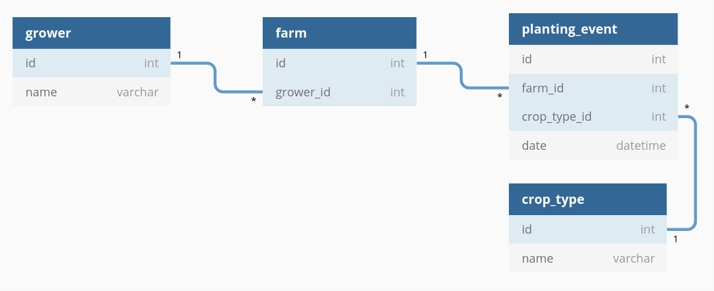

# Climate test

## How to use

#### Prerequisites
- Having docker-compose installed: https://docs.docker.com/compose/

#### Installation

1) Open your favourite terminal and go to an empty directory or create one.

2) run:
```
git clone https://github.com/Makiavelo/climate_test.git
cd climate_test
docker-compose up --build
```

#### Connect to the container

1) Open your favourite terminal.

2) run:
```
docker exec -it serverc /bin/bash
cd /var/www/html/climate_test/
php composer.phar install
```

#### Running the growers search command
The first argument is the crop type, and there's an optional second parameter which is the year. 
By default the year is the current year.
```
php bin/console app:search-growers corn
php bin/console app:search-growers soybeans

php bin/console app:search-growers corn 2018
php bin/console app:search-growers soybeans 2018
```

#### Running the tests
```
php bin/phpunit
```
The first time this command is ran, PHPUnit dependencies will be installed.

#### Source files
All the models can be found under:
```
www/climate_test/src/Entity
```

The repository where the query is executed can be found here:
```
www/climate_test/src/Repository/GrowerRepository.php
```
[Link to file](www/climate_test/src/Repository/GrowerRepository.php)

And here is the command code
```
www/climate_test/src/Command/SearchGrowersCommand.php
```
[Link to file](www/climate_test/src/Command/SearchGrowersCommand.php)

#### Database schema

Initial records can be found in: 'dump/create_db.sql'

#### View database via browser
Go to [this link](http://localhost:8002) (http://localhost:8002)

And use the following credentials:
```
Server: dbc
Username: user
Password: test
```

Select the 'climate' database and browse all the records.